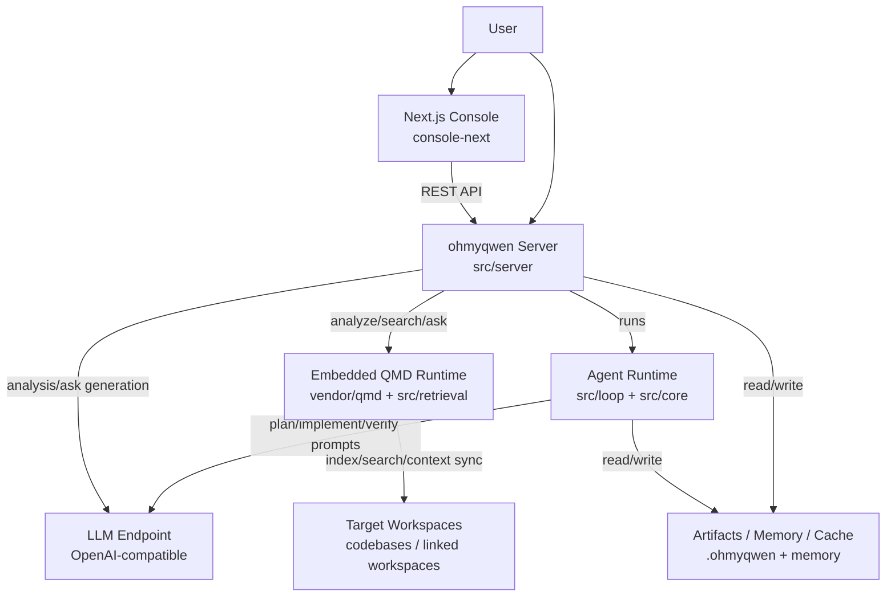
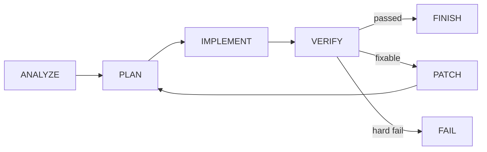
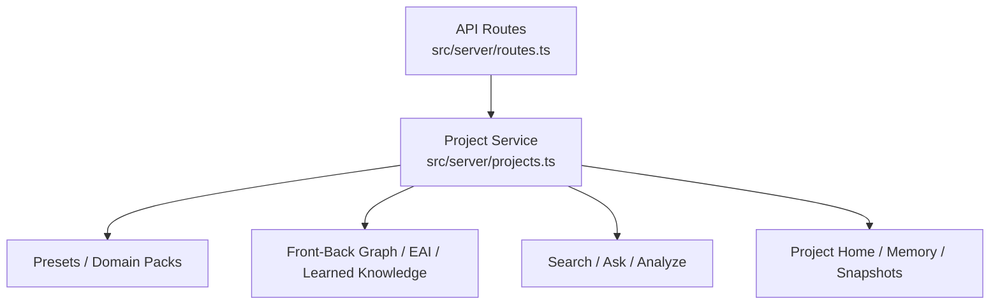
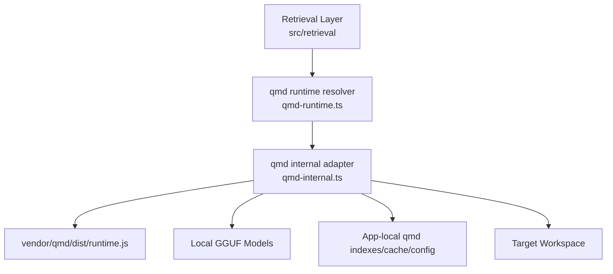
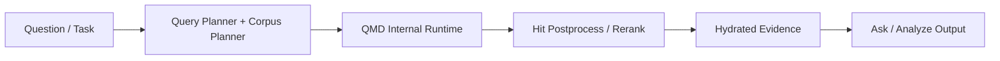
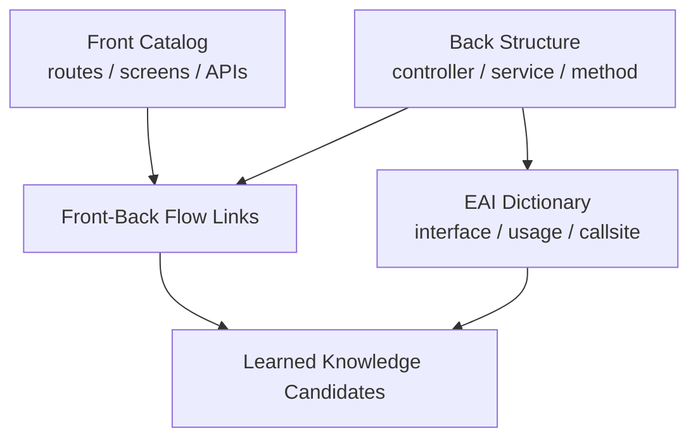
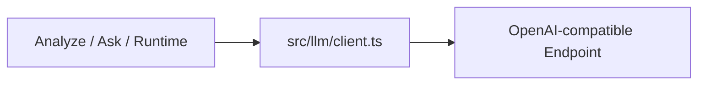
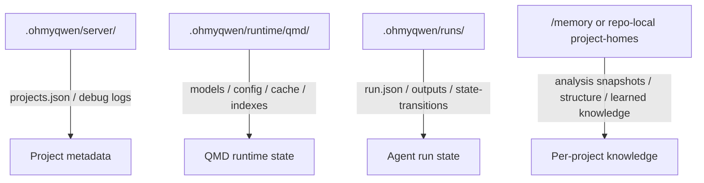
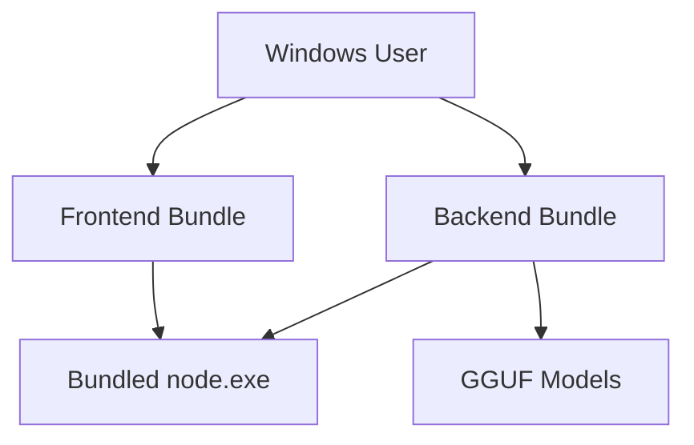

# Architecture (current)

`ohmyqwen`은 폐쇄망/제한망 환경에서 동작하는 **로컬 에이전틱 코딩 런타임 + 프로젝트 분석 서버**다.  
현재 기준의 운영 아키텍처는 다음 3축으로 보면 된다.

- **Run Runtime**: `ANALYZE -> PLAN -> IMPLEMENT -> VERIFY`
- **Project Analysis Server**: 프로젝트 등록 / 색인 / 구조분석 / 질문응답
- **Embedded QMD Runtime**: 프로젝트 코드 검색/색인/컨텍스트 동기화의 내부 검색 엔진

---

## 1. 큰 그림



핵심 포인트:

- **Frontend와 Backend는 분리된 프로세스**다.
- **QMD는 외부 설치 도구가 아니라, 프로젝트 내부에 vendoring된 런타임**이다.
- **프로젝트 코드베이스는 외부 workspace일 수 있고**, 검색/메모리/캐시는 `ohmyqwen`이 관리한다.

---

## 2. 현재 디렉토리 기준 주요 구성

```text
src/
  core/          상태머신, 입력/출력 타입, 계약
  loop/          런 루프 실행기
  llm/           OpenAI-compatible LLM client, model settings
  context/       context packer, retrieval inspection
  retrieval/     qmd/lexical/hybrid 검색 체인
  server/        프로젝트 분석 API, 메모리/도메인/그래프
  gates/         verify/objective-contract
  tools/         executor
console-next/    Next.js 콘솔 UI
vendor/qmd/      내장 QMD 런타임 소스
config/          retrieval/llm/plugins presets
docs/            운영/아키텍처/오프라인 문서
.ohmyqwen/       run/cache/server/runtime artifacts
```

---

## 3. 런타임 제어면 (Agent Runtime)



### 담당 파일

- `src/core/state-machine.ts`
- `src/loop/runner.ts`
- `src/loop/run-state.ts`
- `src/gates/verify.ts`
- `src/gates/objective-contract.ts`

### 역할

- 단계 전이 강제
- run 상태 영속화
- 품질게이트(build/test/lint/objective-contract)
- 실패 signature 기반 재시도/전략 전환

### 영속 아티팩트

- `.ohmyqwen/runs/<runId>/run.json`
- `.ohmyqwen/runs/<runId>/state-transitions.jsonl`
- `.ohmyqwen/runs/<runId>/outputs/*.json`

---

## 4. 프로젝트 분석 서버 구조



### 주요 API

- `POST /api/projects`
- `POST /api/projects/:id/index`
- `POST /api/projects/:id/analyze`
- `POST /api/projects/:id/search`
- `POST /api/projects/:id/ask`
- `GET /api/projects/:id/debug`

### 분석 서버 내부 핵심 기능

- 프로젝트 등록 / linked workspace 관리
- warmup indexing
- 구조 인덱스 생성
- front-back graph 생성
- EAI dictionary 생성
- learned knowledge 후보 축적
- 질문 전략 분류 / evidence hydration / quality gate

---

## 5. Embedded QMD Runtime 구조

현재 운영 기준으로 QMD는 **외부 `qmd` 명령을 호출하는 도구가 아니라**,  
`vendor/qmd`를 프로젝트 내부에 포함한 **internal runtime**이다.

### 큰 그림



### 현재 구성 파일

- `src/retrieval/qmd-runtime.ts`
- `src/retrieval/qmd-internal.ts`
- `src/retrieval/qmd-search.ts`
- `src/retrieval/qmd-context.ts`
- `src/retrieval/qmd-corpora.ts`
- `src/retrieval/providers/qmd.ts`
- `vendor/qmd/dist/runtime.js`

### 현재 원칙

- **server/analyze/search/ask는 internal runtime 기준**
- **qmd vendor/runtime/models 경로는 앱 번들 쪽 기준**
- **프로젝트 workspace는 검색 대상일 뿐, qmd runtime 소유 디렉토리가 아님**

즉:

- `vendor/qmd/dist/runtime.js`는 `ohmyqwen` 번들 내부에 존재
- 외부 프로젝트(`D:/workspace/dcp-services`)는 index 대상
- qmd cache/index/model은 앱 내부 `.ohmyqwen/runtime/qmd`에 위치

### QMD 역할

1. collection/index 동기화
2. multi-corpus 검색
   - backend-code
   - frontend-code
   - config-xml
   - docs-memory
3. context sync
4. query / search / rerank
5. degraded search fallback

### 현재 검색 체인



---

## 6. Front-Back / EAI / Learned Knowledge 계층



### 관련 파일

- `src/server/front-back-graph.ts`
- `src/server/flow-links.ts`
- `src/server/flow-trace.ts`
- `src/server/eai-dictionary.ts`
- `src/server/eai-links.ts`
- `src/server/learned-knowledge.ts`

### 역할

- Vue/route/API → backend controller/service 연결
- Java method → EAI interface 연결
- 질문/분석 결과에서 반복 등장하는 지식 후보 축적
- 다음 질문에서 soft prior로 재사용

---

## 7. LLM 계층



### 역할

- 구조분석 JSON 생성
- 질문 전략 분류
- 질문 응답 생성
- 런타임 PLAN/IMPLEMENT 제안

### 현재 원칙

- 기본 endpoint는 OpenAI-compatible
- 모델 설정은 `config/llm-settings.json`
- QMD 모델(GGUF)과 **답변 생성용 LLM endpoint는 별개**

---

## 8. 저장 구조



### 주요 위치

- `.ohmyqwen/server/projects.json`
- `.ohmyqwen/server/project-debug-events.jsonl`
- `.ohmyqwen/runtime/qmd/models/`
- `.ohmyqwen/runtime/qmd/indexes/`
- `<projectHome>/memory/`
- `<projectHome>/.ohmyqwen/cache/structure-index.v1.json`

---

## 9. 폐쇄망 Windows x64 배포 구조



### backend bundle

- `dist/`
- `config/`
- `vendor/qmd/dist/`
- `node_modules/`
- optional `node-runtime/`
- optional `.ohmyqwen/runtime/qmd/models/`

### frontend bundle

- `.next/`
- `node_modules/`
- `public/`
- `package.json`
- `next.config.mjs`
- optional `node-runtime/`

### 실행 래퍼

- backend: `serve-ohmyqwen.cmd`
- frontend: `serve-console.cmd`

### backend 실행 시 기본 강제 환경

- `OHMYQWEN_SERVER_TRACE=1`
- `OHMYQWEN_QMD_RUNTIME_ROOT=<bundle>/.ohmyqwen/runtime/qmd`
- `OHMYQWEN_QMD_VENDOR_ROOT=<bundle>/vendor/qmd`
- `OHMYQWEN_QMD_MODELS_DIR=<bundle>/.ohmyqwen/runtime/qmd/models`

즉 폐쇄망에서는:

- 별도 `qmd` 설치가 필요 없다
- 별도 `pnpm install`이 필요 없다
- bundle 안의 내장 qmd runtime을 그대로 사용한다

---

## 10. 현재 설계 원칙 요약

1. **QMD는 외부 툴이 아니라 내부 런타임**
2. **프로젝트 workspace와 qmd runtime 소유 디렉토리를 분리**
3. **검색/구조분석/질문응답은 evidence-first**
4. **품질게이트와 confidence는 별개가 아니라 함께 동작**
5. **폐쇄망 Windows x64 배포를 전제로 bundle-first로 운영**

---

## 11. 파일 참조 빠른 목록

- Runtime loop
  - `src/core/state-machine.ts`
  - `src/loop/runner.ts`
- Server
  - `src/server/app.ts`
  - `src/server/routes.ts`
  - `src/server/projects.ts`
- Retrieval / QMD
  - `src/retrieval/config.ts`
  - `src/retrieval/qmd-runtime.ts`
  - `src/retrieval/qmd-internal.ts`
  - `src/retrieval/qmd-search.ts`
  - `src/retrieval/providers/qmd.ts`
  - `vendor/qmd/`
- Frontend
  - `console-next/`
- Offline packaging
  - `scripts/bundle-offline-win64.ps1`
  - `scripts/bundle-console-win64.ps1`
  - `.github/workflows/win64-offline-bundle.yml`
