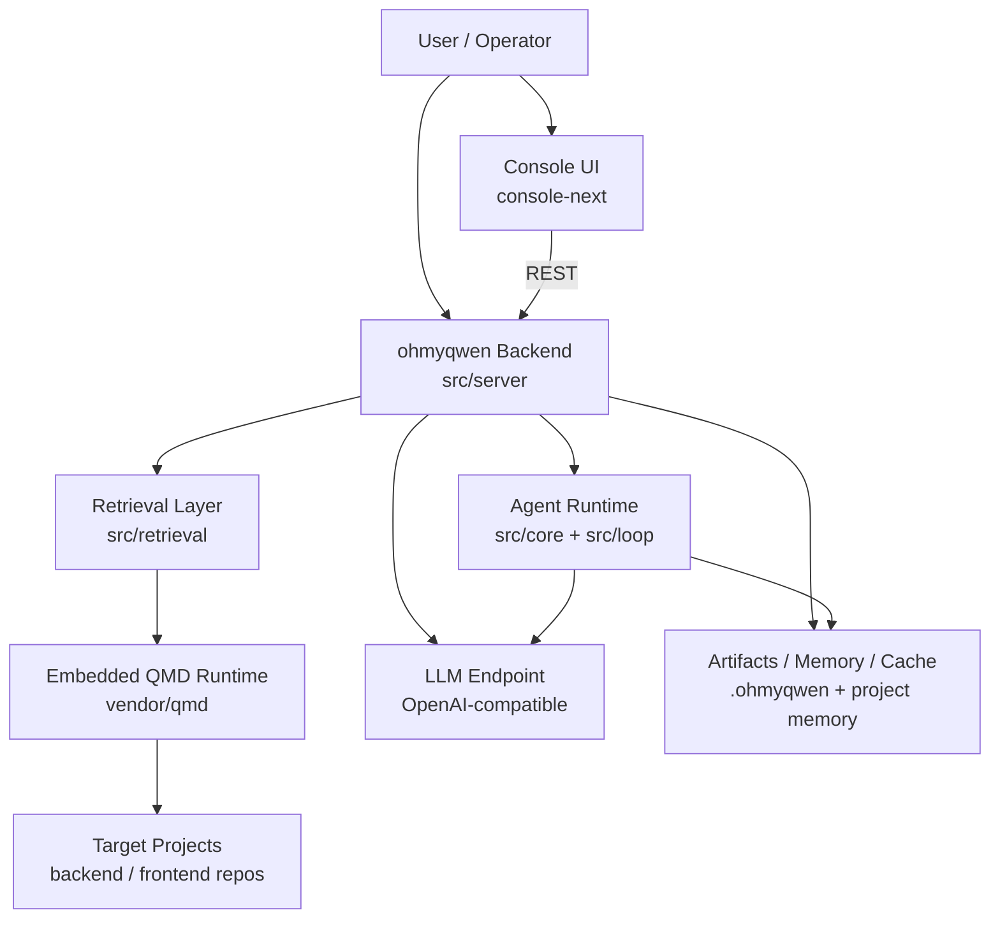
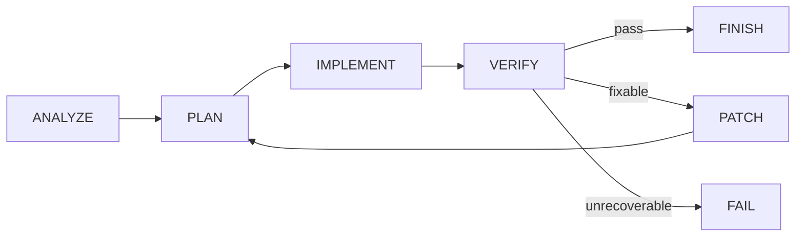
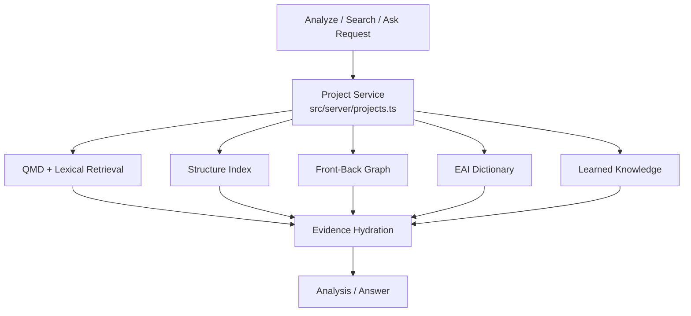
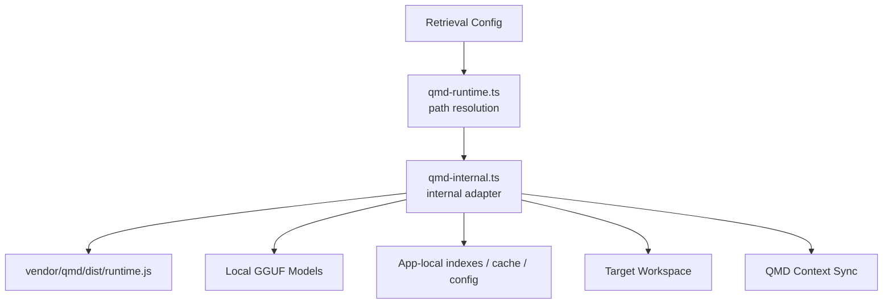
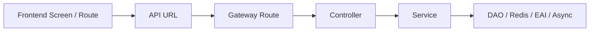
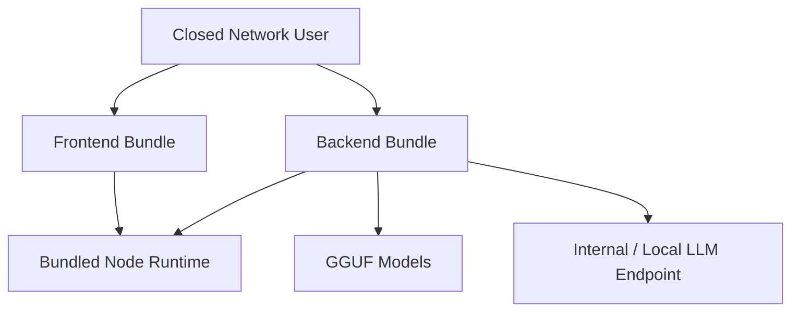
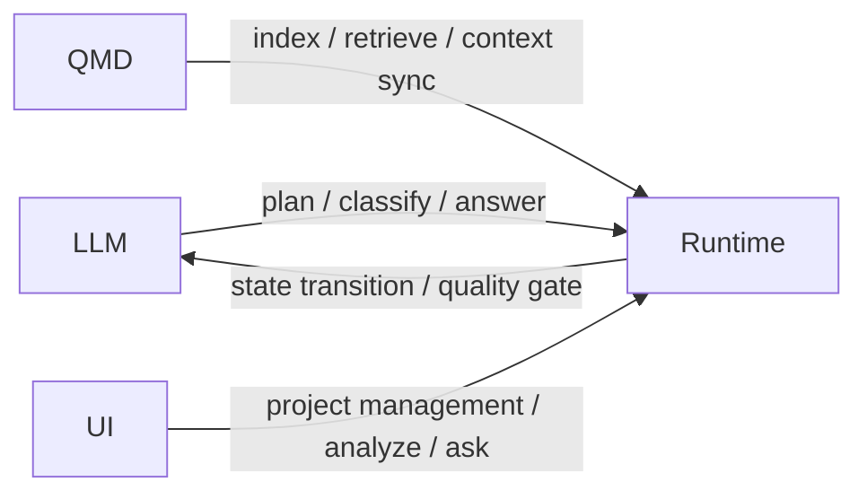

# Big Picture Architecture Diagrams

이 문서는 `ohmyqwen`의 큰 그림을 빠르게 파악하기 위한 다이어그램 모음이다.

---

## 1. System Context

---

## 2. Runtime Control Loop

핵심 특징:

- LLM은 제안 생성 담당
- 최종 상태 전이와 품질 판정은 런타임이 강제

---

## 3. Project Analysis / Ask Flow

---

## 4. Embedded QMD Internal Architecture

핵심 원칙:

- 외부 `qmd` 명령 의존 제거
- `vendor/qmd`를 내부 런타임으로 사용
- 프로젝트 workspace와 qmd runtime 디렉토리 분리

---

## 5. Cross-Layer Knowledge Graph

이 그래프를 바탕으로:

- front → back 흐름 추적
- EAI 연결
- capability/domain 추론
- 질문 응답 근거 강화

---

## 6. Storage Layout

```mermaid
flowchart TB
  ServerStore[".ohmyqwen/server"]
  RunStore[".ohmyqwen/runs"]
  QmdStore[".ohmyqwen/runtime/qmd"]
  ProjectHome["project home / memory"]

  ServerStore --> ProjectsJson[projects.json]
  ServerStore --> DebugLogs[project-debug-events.jsonl]

  RunStore --> RunJson[run.json]
  RunStore --> Transitions[state-transitions.jsonl]
  RunStore --> Outputs[outputs/*.json]

  QmdStore --> ModelsDir[models]
  QmdStore --> IndexesDir[indexes]
  QmdStore --> CacheDir[cache]
  QmdStore --> ConfigDir[config]

  ProjectHome --> StructureSnapshot[structure-index]
  ProjectHome --> Analysis[project-analysis]
  ProjectHome --> FrontBack[front-back-graph]
  ProjectHome --> EaiMemory[eai-dictionary]
  ProjectHome --> Learned[learned-knowledge]
```

---

## 7. Offline Windows x64 Deployment

실행 기준:

- backend: `serve-ohmyqwen.cmd`
- frontend: `serve-console.cmd`

---

## 8. Separation of Responsibilities

정리:

- **LLM**: 생성
- **Runtime**: 통제/검증
- **QMD**: 검색/색인
- **UI**: 운영 인터페이스
